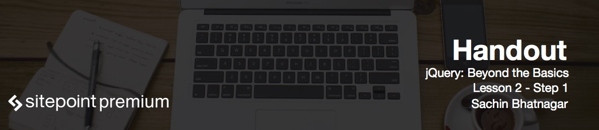

# Introduction to animation 

**Animation** means changing property's value over time. When we talk about web and animation in the same sentence, probably **Flash** comes to mind first. Until recently Flash used to be the only way to present rich animation on the web. All that changed after Steve Jobs literally wrote off Flash's future in 2010 in favour of HTML 5. Apple has decided not to support Flash on iOS mobile and handheld devices. All this led to a slow but persistent movement against the use of Flash: nowadays it is much less widespread.

# Types of animations

We can categorize animation on the web into three basic types:

* Simple animation sequences, where elements move from point A to point B.
* State-based animations setups. For example, menus which open up when a button is pressed, or a modal dialog that appears when an event occurs.
* Multi-layered animation environments, where multiple properties change over a period of time.

What options do we really have if not using Flash? We can animate elements on a web page by either using **CSS3** or **JavaScript**.

# Introduction to CSS3 animations

In CSS3, you can use the `animation` property that sometimes requires the use of vendor prefixes. Once you define the `animation` property, you set it to a batch of **keyframes**. These keyframes denote the varying state of a property, such as the `left` property over a span of time.

You can also employ the `transition` property to set a property change over a given duration. When that property is overloaded, it animates forward and vice versa.

# Introduction to JavaScript animations

With JavaScript, one way that you can get things to animate is writing a function that iteratively changes an element's CSS property by calling itself recursively. Using `setTimeout()`, we can delay the recursive call, thereby demonstrating an animated effect.

```js
var elem = document.querySelector(".box");

(function animate() {
	var leftProp = window.getComputedStyle(elem).getPropertyValue("left");
	var step = Number(leftProp.replace('px', '')) + 1;
	elem.style.left = step + "px";
	if(step < 600) {
		setTimeout(function() {
			anumate();
		}, 10);
	}
})();
```

Here, the `left` property of an element is being animated from its original state to 600 pixels by querying its value every time that the animate function is called, and incrementing it by one until it reaches its desired value.

However, `setTimeout()` is not really an efficient way to animate, so modern browsers offer the `requestAnimationFrame()` method, which works in more or less the same way but is much better in terms of performance. This method, however, is not available in Internet Explorer 9 and below and requires polyfills in some cases.

There is also an upcoming web animations API which looks very similar to how jQuery's animation techniques look, and is quite easy to understand.

# Compare CSS3 and JavaScript animations

Let's compare CSS3 animation with animation using JavaScript:

* CSS3 animation is essentially logic-less: you cannot define your set of conditions based on which the animation should run. JavaScript, on the other hand, does allow you to define states and logic for animating elements.
* CSS3, by itself, cannot trigger animation except in a few simple cases. In JavaScript, you do have full control.
* In terms of performance, CSS3 animation is mostly hardware accelerated in modern browsers making effective use of your GPU hardware. With JavaScript, not all methods employ hardware acceleration.
* CSS3 Animation, however, is not supported on IE 9 and below. In JavaScript, compatibility depends upon the method used.
* While CSS3 is great for simple animation tasks, you still need JavaScript if you want to create logic-driven and timeline-based animation sequences.
* Finally, CSS3 does not let you know about the progress of an animation. In JavaScript, you can monitor an animation's playback progress.

All of this brings us to jQuery, but let me pinpoint one thing before we begin.

# Animation in jQuery

jQuery is not designed natively for animation and its built-in animation methods offer an average performance since they rely on the `setTimeout()` function, which itself is not very efficient. Therefore, it's best not to use jQuery for complicated timeline-based animation sequences. But what jQuery excels at, on the contrary, is in its flexible animation mechanism. You get easy and fast control over moderate to intermediate animation tasks, and it provides backward compatibility and fallback for all the browsers. This ensures your animation works in even older browsers where CSS3 animation is not supported.

These methods themselves are very easy to learn and performance issues can be overcome by using third party animation libraries, like the popular Greensock Animation Library or Velocity.js, which integrates seamlessly into jQuery's way of working.

