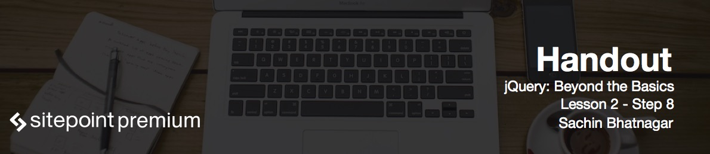

# Introduction to smooth scrolling

Among other things, jQuery's `animate` method lets you play with scrolling on a web page. With this you can easily get your pages to scroll smoothly. Nowadays single page websites are widespread and smooth scrolling is almost a necessity.

# Working with jQuery animate for smooth scrolling

Open up *smoothscroll_Begin.htm* from the accompanying files.

We have a single page website with different sections containing excerpts from four popular short stories. At the top of the page we have a fixed navigation bar with links to these sections. Clicking on these links scrolls the page down instantly to the respective section. We also have a fixed button which would be set up so that it scrolls the page back to the top.

Each of these sections has a unique ID associated with it and links simply reference these IDs directly.

The first thing we will do is prevent our hyperlinks from jump scrolling the page to the sections represented by their `href` attributes:

```js
$('.navLinks').on('click', function(e) {
	e.preventDefault();
	e.stopPropagation();
});
```

`evt` is the event object passed into the callback function of the event handler. `evt.preventDefault()` disables the browser's default behavior when clicking the link. `evt.stopPropogation()` prevents this click event from bubbling up the hierarchy and firing on parent elements.

Now let's proceed to the actual smooth scrolling:

```js
var webpage = $('html,body');
$('.navLinks').on('click', function(e) {
  e.preventDefault();
  e.stopPropagation();
  webpage.stop().animate({
    scrollTop:$($(this).attr('href')).offset().top
  }, 2000, "easeInOutQuint");
}); 
```

We want to animate both `html` and `body` because some browsers consider the `body` when scrolling, while others consider the `html` element.

The `stop` method is used to stop any existing animation before piping in the `animate` method.

The `offset` method computes the actual offset position of the selected section from the very top of the page. We use this value to scroll to the required position.

Set up the `top` button to gently scroll the page back to the top:

```js
$('#top').on('click', function(e) {
  e.preventDefault();
  e.stopPropagation();
  webpage.stop().animate({
    scrollTop:0
  }, 2000, "easeInOutQuint");
});
```

# Implementing smooth scrolling on mouse wheel

You will still experience the standard jittery scroll when rotating the wheel on your mouse. Let's fix that as well:

```js
$(window).on('wheel', function(e) {
  e.stopPropagation();
  e.preventDefault();
  var scrollAmt = e.originalEvent.wheelDelta > 0 ? '-=350' : '+=350';
  webpage.stop().animate({
    scrollTop:scrollAmt
  },500,"linear");
});
```

`wheelDelta` has a negative value when we are scrolling down the page and a positive when we are scrolling up.

Now the mouse wheel gently scrolls the page up and down.